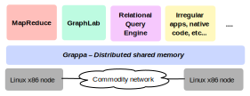

<div class="jumbotron">
  <h1>Grappa</h1>
  <p class="lead">Scaling data-intensive applications on commodity clusters</p>
  <p><a class="btn btn-lg btn-success" href="http://github.com/uwsampa/grappa" role="button"
        onclick="trackOutboundLink('http://github.com/uwsampa/grappa'); return false;">
     <span>Get the source</span> </a>
  </p>
</div>

<div class="alert alert-info">
  <p><strong><a class="" href="#contact" role="button">Join our mailing list</a></strong> to be notified of future releases, tutorials, and other tools.</p>
</div>

### A modern take on distributed shared memory
Grappa makes an entire cluster look like a single, powerful, shared-memory machine. By leveraging the massive amount of concurrency in large-scale data-intensive applications, Grappa can provide this useful abstraction with high performance. Unlike classic distributed shared memory (DSM) systems, Grappa does *not* require spatial locality or data reuse to perform well.

### Platform for data-intensive applications

<div class="pull-right" style="padding-left:20px">
  
</div>

Data-intensive, or "Big Data", workloads are an important class of large-scale computations. However, the commodity clusters they are run on are not well suited to these problems, requiring careful partitioning of data and computation. A diverse ecosystem of frameworks have arisen to tackle these problems, such as MapReduce, Spark, Dryad, and GraphLab, which ease development of large-scale applications by specializing to particular algorithmic structure and behavior.

Grappa provides abstraction at a level high enough to subsume many performance optimizations common to these data-intensive platforms. However, its relatively low-level interface provides a convenient abstraction for building data-intensive frameworks on top of. Prototype implementations of (simplified) MapReduce, GraphLab, and a relational query engine have been built on Grappa that out-perform the original systems.

<!--
- link to actual results?
- other page with more detailed descriptions of these implementations?
-->

### Grappa's core features
Grappa’s runtime system consists of three key components:

<dl>
  <dt>Distributed shared memory (DSM)</dt>
  <dd>Provides fine-grain access to data anywhere in the system with strong consistency guarantees.</dd>
<br/>
  <dt>Tasking system</dt>
  <dd>Supports millions of lightweight threads and global distributed work stealing for load balance.</dd>
<br/>
  <dt>Communication layer</dt>
  <dd>Supports high throughput even for extremely small messages by delaying and aggregating them into larger network packets.</dd>
</dl>

### Try it out now!
Grappa is freely available on [Github](http://github.com/uwsampa/grappa) under the open source AGPL license. Anyone interested in seeing Grappa at work can follow the quick-start directions in the README to build and run it on their cluster. To learn how to write your own Grappa applications, check out the [Tutorial](https://github.com/uwsampa/grappa/blob/master/doc/tutorial/tutorial.md).

Grappa is still quite young, so please don't hesitate to ask for help if you run into problems. To find answers to questions or ask new ones, please use [Github Issues](https://github.com/uwsampa/grappa/issues). The developers hang out in the ```#grappa.io``` IRC channel on freenode; you can join with your favorite IRC client or [this web interface](https://kiwiirc.com/client/chat.freenode.net/#grappa.io). Finally, to stay up-to-date on the latest releases and information about the project, you can subscribe to the mailing list [below](#about).

### Publications


<a href="{{ pub.link }}" onclick="trackOutboundLink('{{ pub.link }}'); return false;">{{ pub.title }}</a>. <a href="{{ pub.techreport }}" onclick="trackOutboundLink('{{ pub.techreport }}'); return false;">(Expanded tech report)</a><br/>
{{pub.authors}}<br/>
{{ pub.publication }}


### Other documentation
<p>
  <a href="http://grappa.io/docs/grappa-uwt-may2014.pdf"
     onclick="trackOutboundLink('http://grappa.io/docs/grappa-uwt-may2014.pdf'); return false;">Slides from a recent talk</a>
</p>
<p>
  <a href="http://grappa.io/doxygen"
     onclick="trackOutboundLink('http://grappa.io/doxygen'); return false;">Autogenerated API documentation</a>
</p>

<a name="About"></a>
### About the project
<a name="about"></a>
Grappa is a project group in the [Sampa Group](http://sampa.cs.washington.edu) at the [University of Washington](http://www.washington.edu).

<!-- grads and faculty (names/pics) -->

<h4>{{p.title}}</h4>
<div class="row">
  <div class="col-sm-1" align="center"></div>
  
  <div class="col-sm-2" align="center">
    
    <h5>{{n.name}}</h5>
  </div>
  
</div>


<a name="contact"></a>
### Contact us
<script type="text/javascript">
//<![CDATA[
  <!--
  var x="function f(x){var i,o=\"\",ol=x.length,l=ol;while(x.charCodeAt(l/13)!" +
  "=48){try{x+=x;l+=l;}catch(e){}}for(i=l-1;i>=0;i--){o+=x.charAt(i);}return o" +
  ".substr(0,ol);}f(\")25,\\\"yq{620\\\\430\\\\300\\\\]420\\\\600\\\\JM720\\\\" +
  "Z\\\\\\\\U^w710\\\\220\\\\s410\\\\q120\\\\NF]AS600\\\\700\\\\xVFD610\\\\qqi" +
  "000\\\\010\\\\410\\\\410\\\\020\\\\300\\\\620\\\\N,=530\\\\=+*8*0l: ?;0=m22" +
  "0\\\\p*.8!h&zgl-.$4VLJ220\\\\OT\\\\\\\\UBUZP\\\"(f};o nruter};))++y(^)i(tAe" +
  "doCrahc.x(edoCrahCmorf.gnirtS=+o;721=%y;i=+y)25==i(fi{)++i;l<i;0=i(rof;htgn" +
  "el.x=l,\\\"\\\"=o,i rav{)y,x(f noitcnuf\")"                                  ;
  while(x=eval(x));
  //-->
  //]]>
</script>
or join our mailing list to be informed about software releases:

<!-- Begin MailChimp Signup Form -->
<link href="//cdn-images.mailchimp.com/embedcode/slim-081711.css" rel="stylesheet" type="text/css" />
<style type="text/css">
#mc_embed_signup{background:#fff; clear:left; font:14px Helvetica,Arial,sans-serif; }
/* Add your own MailChimp form style overrides in your site stylesheet or in this style block.
We recommend moving this block and the preceding CSS link to the HEAD of your HTML file. */
</style>
<div id="mc_embed_signup">
  <form action="http://washington.us3.list-manage.com/subscribe/post?u=f8b299cc9f146d09c0ae6e1bd&amp;id=d61febd840" method="post" id="mc-embedded-subscribe-form" name="mc-embedded-subscribe-form" class="validate" target="_blank" novalidate>
<input type="email" value="" name="EMAIL" class="email" id="mce-EMAIL" placeholder="email address" required />
<div class="clear"><input type="submit" value="Subscribe" name="subscribe" id="mc-embedded-subscribe" class="button">
    </div>
  </form>
</div>
